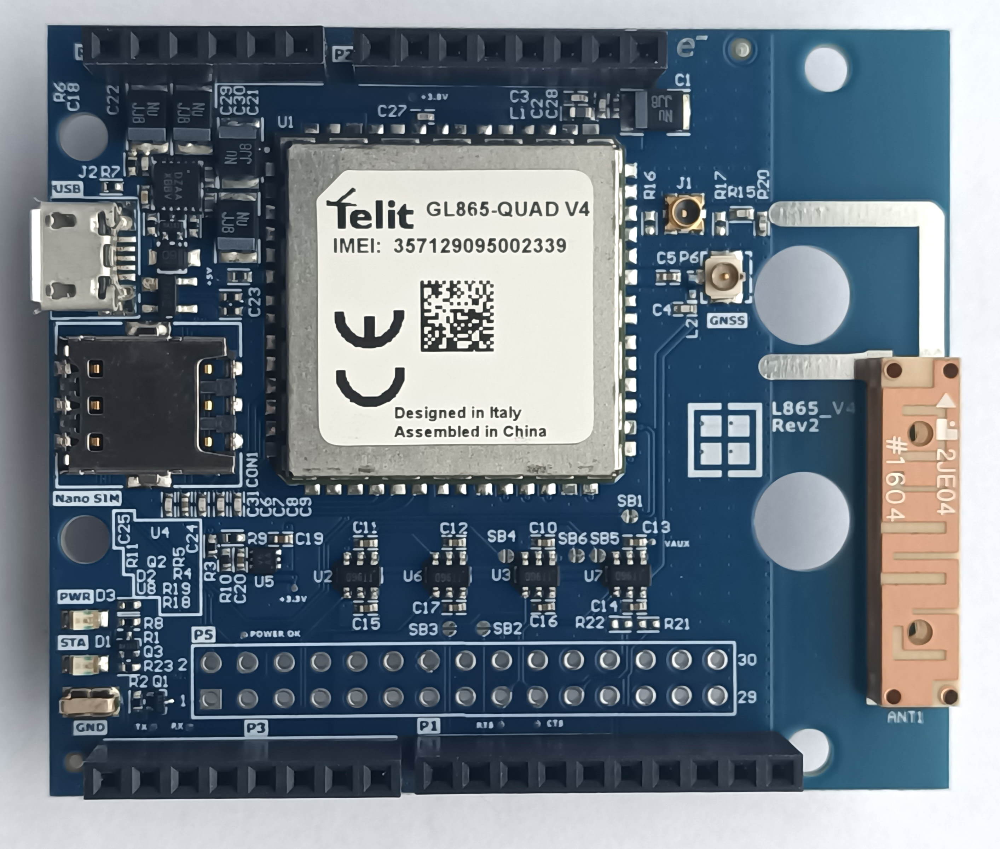

# RUT_L865_QUAD_V4 Arduino Shield

This is the Arduino Shield for the Telit 2G quad-band modem GL865-QUAD V4. The footprint and design are also compatible with ML865C1-EA LTE-M, NB-IoT [LPWA] modem.
The GL865 V4 Shield is designed by Rutronik for quick start-up and evaluation of Telit’s GL865 QUAD V4 cellular modem. 

## Features

-  Telit GL865 QUAD V4 Cellular Modem.
-   Compatibility with Telit ML865C1-EA Cellular Modem.
-   Compatibility with Telit ML865C1-EA Cellular Modem.
-   Nano SIM card slot.
-   Micro USB connector for power supply.
-   ISL80103 LDO 3A.
-   ISL9021AIRUNZ LDO 250mA 3.3V.
-   Arduino-compatible extension connectors.

## Legal Disclaimer

The evaluation board including the software is for testing purposes only and, because it has limited functions and limited resilience, is not suitable for permanent use under real conditions. If the evaluation board is nevertheless used under real conditions, this is done at one’s responsibility; any liability of Rutronik is insofar excluded. 

